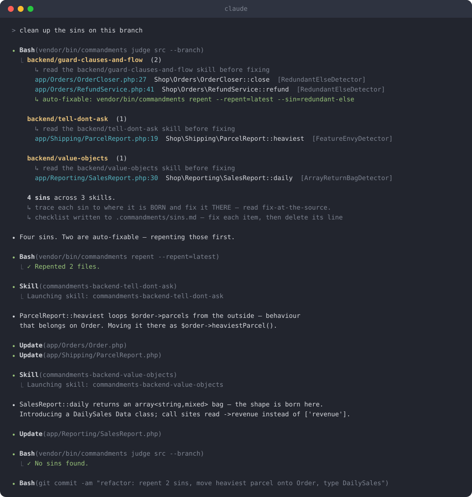
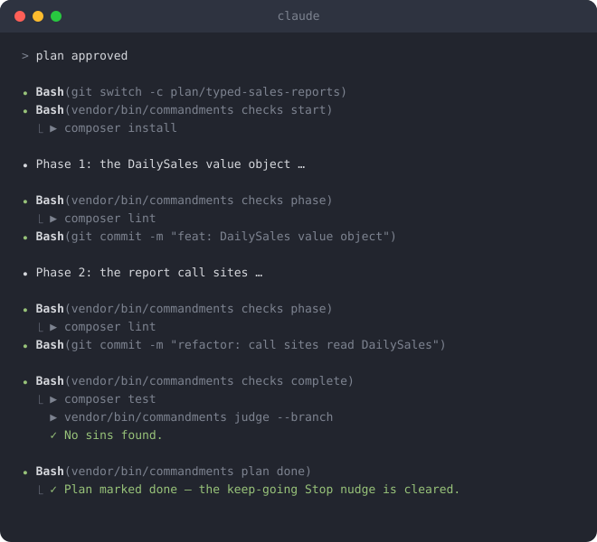
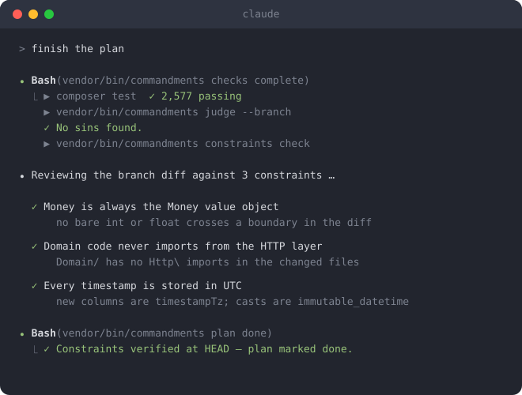

# Code Commandments

> An architecture linter for PHP & Vue, built to drive AI coding agents.

**code-commandments** judges a PHP and Vue codebase against a set of architectural
disciplines. Every violation (a "sin") is reported as a `file:line`, grouped under
the **skill** that teaches the fix.

It's built for AI coding agents: point your agent at a codebase and it reads the
skill each sin names, fixes at the source, and re-runs until clean. You can drive
it by hand too.

A linter tells you a line is too long. code-commandments tells you *this array
should be a value object, and here's the discipline that explains why*.

## Contents

- [How it works](#how-it-works)
- [Install](#install)
- [Usage](#usage)
- [Configuration](#configuration)
- [Freezing a file](#freezing-a-file)
- [Hooks](#hooks)
- [How detectors are tested](#how-detectors-are-tested)
- [Skills](#skills)
- [Sins & detectors](#sins--detectors)
- [Auto-fixing](#auto-fixing)
- [Scaffolding](#scaffolding)
- [Developing detectors](#developing-detectors)
- [License](#license)

## How it works

The loop is simple:

1. **Judge**: `commandments judge` prints every sin as a `file:line`, grouped by skill.
2. **Learn**: each sin names a **skill**; you (or your agent) read it.
3. **Fix**: fix at the source, or let `commandments repent` [auto-fix](#auto-fixing).
4. **Repeat**: re-run until clean (exit code `0`).

One pass of that loop, with an agent driving:

<p align="center">
  
</p>

Under the hood there are two layers:

- **Skills**: the teaching layer. One doc per discipline, the source of truth for
  what "good" looks like.
- **Sin detectors**: small finders that read the syntax tree. Each finds one kind
  of sin and names the skill that fixes it. Detectors *find*, skills *teach*,
  scribes *[auto-fix](#auto-fixing)*.

**You don't need the packages a rule is about.** Detectors match on real *types*,
so a rule for a package your project doesn't use never fires. Nothing to install
or configure to keep it quiet.

## Install

```bash
composer require --dev jessegall/code-commandments
vendor/bin/commandments install
```

## Usage

```bash
# scan. With no path, judge reads the source roots from .commandments/config.php
# (auto-detected from composer.json on the first run)
vendor/bin/commandments judge
vendor/bin/commandments judge src                  # or point it at a path

# scope to one skill (group) or one sin
vendor/bin/commandments judge src --skill=exceptions
vendor/bin/commandments judge src --sin=swallow-catch

# scope to what you changed
vendor/bin/commandments judge src --branch         # branch vs main (--branch=BASE to override)
vendor/bin/commandments judge src --changes        # uncommitted working-tree changes

# detectors run across 8 workers by default (capped at CPU cores); --parallel=1 disables
vendor/bin/commandments judge src --parallel=4

# skip paths (comma-separated fragments); list everything
vendor/bin/commandments judge src --exclude=Generated,Legacy
vendor/bin/commandments judge --list

# executing an approved plan (see Hooks below)
vendor/bin/commandments checks start          # run the project's start / phase / complete checks
vendor/bin/commandments checks phase
vendor/bin/commandments checks complete       # full gate: your checks, then `judge --branch`
vendor/bin/commandments plan status           # is a plan active? (`plan done` ends it)

# hold every stop until a condition you set holds (no plan needed — see Hooks below)
vendor/bin/commandments until "the full test suite passes"
vendor/bin/commandments until met 1           # verified it — strike it off (`until list` shows them)
```

Exit code is non-zero when sins are found.

## Configuration

**You don't have to configure anything.** Every detector is enabled out of the box.
Configuration is opt-out: silence a rule, tune a threshold, or add a detector of
your own.

A commented `.commandments/config.php` is scaffolded on install. It returns a
closure given a `Config`; no framework required, the CLI loads the file itself:

```php
<?php

use JesseGall\CodeCommandments\Config;
use JesseGall\CodeCommandments\Detectors\Backend\DataClumpDetector;
use JesseGall\CodeCommandments\Detectors\Backend\Laravel\FacadeCallDetector;
use JesseGall\CodeCommandments\Detectors\Frontend\DeepNestedDetector;
use JesseGall\CodeCommandments\Sins\Backend\Spatie\NonFinalData;
use JesseGall\CodeCommandments\Skills\Backend\ValueObjects;

return function (Config $config): void {
    $config
        // The source roots judge and repent scan (auto-detected on first run).
        ->paths('app', 'src')

        // Silence a rule by its Sin class (drops the detector that finds it).
        ->disable(NonFinalData::class)

        // ...or by a specific Detector class.
        ->disable(FacadeCallDetector::class)

        // ...or by a whole Skill class (every detector that discipline teaches).
        ->disable(ValueObjects::class)

        // Add a detector that lives in YOUR codebase.
        ->detector(\App\Commandments\NoRawSqlDetector::class)

        // Tune thresholds. Setters chain, so several knobs fit in one closure.
        ->configure(fn (DeepNestedDetector $d) => $d->maxDepth(10)->maxRemaining(2))
        ->configure(fn (DataClumpDetector $d) => $d->minClasses(3));
};
```

The scaffold also carries two menus, `$disabledSkills` and `$disabledSins`: every
shipped skill and sin as a commented-out `disable()` argument. Remove the `//` to
turn a rule off. New rules are appended on `composer update`; your edits are kept.

Each move is named for what it registers: `paths`, `disable`, `detector`,
`configure`, `package` (see [Developing detectors](#developing-detectors)), `hook`
and `planExecution` (see [Hooks](#hooks)). `configure` finds the detector by the
closure's first parameter type. Run `commandments config` for a summary of what's
in effect.

## Freezing a file

Some files must not change even though they carry sins — a frozen graph migration
whose body deliberately mirrors its siblings, a snapshot committed for the record,
generated code checked into the tree. Freeze such a file:

```bash
vendor/bin/commandments freeze database/migrations/V5ToV6.php
vendor/bin/commandments unfreeze database/migrations/V5ToV6.php   # lift it
```

`freeze` stamps a `@code-commandments-frozen` comment; you can equally mark a class
by hand with a `#[Frozen]` attribute or an `@frozen` docblock tag.

A frozen file is still **scanned** — the call graph, provenance and type resolution
read it, so findings in *other* files stay correct — but it is never a **target**:
it is never flagged by `judge`, and `repent` never rewrites it. Freezing is a scope,
compounded into every scope the tools resolve, so a cross-file fix whose edits would
touch a frozen file is dropped whole rather than half-applied.

Freeze only what is genuinely immutable. A finding you disagree with belongs in a
`report`; a rule you want off belongs in `disable` — freezing is for files that by
their nature cannot move.

## Hooks

`install` (and every `composer update`, via `sync`) wires a set of **Claude Code
hooks** into `.claude/settings.json`: the cardinal-rule reminder, the "did you
judge?" nudge, and the plan-execution hooks. They self-heal: a hook change reaches
every project on the next `composer update`.

**Your own hooks are never touched.** Every wired command carries a
`# @code-commandments-managed` stamp, and re-wiring strips only stamped commands.
A hook you wrote by hand is always preserved.

The wired hooks — one dispatcher entry per Claude Code event, each fanning out to these handlers:

<!-- BEGIN: hooks-table (auto-generated, run `composer readme`) -->
| Hook | Events | What it does |
|---|---|---|
| `Remind` | `PostToolUse` | Surfaces the cardinal *trace to the source* rule once every 25 tool uses. |
| `JudgeReminder` | `Stop, PreToolUse/Bash` | Nudges you to `judge` what you changed — before a risky Bash command, and on stop. |
| `PlanReminder` | `PostToolUse/ExitPlanMode, Stop` | On plan approval loads the executing-plans skill with your profile; on stop, keeps you going until `plan done` per the plan `mode()` (Supervised/Autonomous/BestEffort/Relentless). |
| `ConstraintReminder` | `PostToolUse` | Re-surfaces the active plan's constraints once every 25 tool uses. |
| `TestingReminder` | `PostToolUse` | Re-surfaces the active plan's testing methodology once every 25 tool uses. |
| `UntilReminder` | `Stop` | Holds every stop while a `commandments until "<condition>"` gate stands, sending you back to verify it. |
| `SessionReset` | `SessionStart` | On a fresh session (startup/clear) wipes lingering plan state, so a crashed run never nudges a new session. |
| `SourceReminder` | `PreToolUse/Edit, PreToolUse/Write, PreToolUse/MultiEdit` | When you edit a test/stub/fixture (which `judge` never scans), nudges you to check the real fix belongs at the SOURCE. |
| `CompactionReminder` | `SessionStart` | After a context compaction (which silently drops loaded skills), reminds you to reload any skill governing your current task. |
| `WorkingState` | `PostToolUse, SessionStart` | Keeps the plan's working-state record alive across compaction — a refresh heartbeat and re-injection on compact/resume. |
<!-- END: hooks-table -->

### Plan execution

Optional. When you approve a plan, a `PostToolUse`/`ExitPlanMode` hook loads the
`executing-plans` skill with your project's profile. The agent branches, works
phase by phase (`checks phase`, commit each), and runs the full gate
(`checks complete`, which appends `judge --branch`) once at the end. Opt into
`keepGoing()` and a `Stop` hook re-nudges until `commandments plan done`.

The profile lives in `.commandments/config.php`, next to everything else. A
starter block is injected on `composer update`, its `onComplete` inferred from
your composer/npm scripts. Edit or remove it freely:

```php
use JesseGall\CodeCommandments\PlanExecution;

$config->planExecution(fn (PlanExecution $plan) => $plan
    ->branchFrom('main')            // base to cut from + judge --branch base
    ->branchPrefix('plan/')         // the plan branch prefix
    ->pushEachPhase()               // push after every phase (default: once at the end)
    ->keepGoing()                   // Stop hook re-nudges until `plan done`
    ->onStart('composer install')   // once, before the first phase
    ->eachPhase('composer lint')    // after each phase (keep it fast)
    ->onComplete('composer test')   // the end gate; judge --branch runs after
    ->constraint('Every new query is scoped to the current tenant.')
    ->constraint('Public API responses stay backwards-compatible — no field removed or renamed.')
    ->enforceConstraintsEachPhase()  // check constraints every phase, not just at the end
    ->testFlow('Write and run the tests for each phase before committing it.') // default test methodology, offered at approval
    ->trackWorkingState());          // keep a living working-state record that survives context compaction
```

Every option (from the `PlanExecution` builder):

<!-- BEGIN: plan-options (auto-generated, run `composer readme`) -->
| Option | What it does |
|---|---|
| `->branchFrom(…)` | The branch a plan is cut from and judged against — the base for the new plan branch and the `judge --branch=<base>` the end gate runs. |
| `->branchPrefix(…)` | The prefix for the branch a plan auto-creates (`plan/` → `plan/<slug>`). |
| `->pushEachPhase(…)` | Push after every phase commit, rather than once at the end. |
| `->mode(…)` | The plan-execution MODE — how autonomously the agent runs an approved plan (confirm-first, supervised, grind-to-finish, or never-stop). |
| `->keepGoing(…)` | Legacy alias for mode: turn on the keep-going Stop hook. |
| `->onStart(…)` | Commands to run ONCE before the first phase — environment setup the whole plan needs (`composer install`, `npm ci`, a `git fetch`). |
| `->eachPhase(…)` | Commands to run after EACH phase's commit — the fast, cheap signal (a linter, a type check) that keeps a phase honest without the full suite. |
| `->onComplete(…)` | Commands to run ONCE at the very end, after the last phase — the exhaustive gate: the full test suite, a lint, a static analysis. |
| `->constraint(…)` | A CONSTRAINT the agent must respect for every plan run — a natural-language architectural invariant `judge` can't decide (e.g. "the frontend is presentation-only"). |
| `->enforceConstraintsEachPhase(…)` | Force the constraint diff-check after EVERY phase, not just at completion. |
| `->testFlow(…)` | The project's DEFAULT testing methodology for a plan run — how tests are written and run as the agent grinds a plan (e.g. "write and run the tests for each phase before committing it"). |
| `->trackWorkingState(…)` | Keep a living WORKING-STATE record while a plan runs — an opt-in discipline where the agent writes its progress and, above all, the conversational deltas (decisions and their rejected alternatives, plan changes agreed in chat, hard-won gotchas, the exact next step) to the session's `.plan-working-state` file (the approval nudge names the exact path), refreshed after each phase and each important event — kept near-current by a `PostToolUse` heartbeat, and re-injected on compact/resume, so a compacted agent resumes with the full picture. |
<!-- END: plan-options -->

**Working state** (`trackWorkingState()`) is opt-in: the agent maintains a living record at
`.commandments/.plan-working-state` — the decisions, conversational plan changes, gotchas, and next step
that live *only* in the conversation — refreshed after each phase and each important event, with a
`PostToolUse` heartbeat nudging a refresh so the record stays near-current, and re-injected on
compact/resume, so a compacted agent resumes with the full picture. It captures only what `git log` + the plan can't reconstruct.

**Constraints** are natural-language architectural invariants a detector *can't* decide
from the AST — "every new query is scoped to the current tenant", "public API responses
stay backwards-compatible", "new endpoints run behind the existing authorization checks".
Where a detector reads a sin off the code's shape, a constraint captures intent only a
reading of the *change* can confirm: the agent verifies each by reviewing its own branch
diff, and the completion gate blocks `commandments plan done` until they hold. By default
a phase gets a soft reminder and completion is the hard gate;
`enforceConstraintsEachPhase()` makes every phase a hard check too. Declare project-wide
ones here; a single run can add its own with `commandments constraints add "…"`.

A plan run in the terminal:

<p align="center">
  
</p>

The completion gate verifying the declared constraints against the branch diff before
`plan done` is allowed:

<p align="center">
  
</p>

### Stop conditions — `until`

No plan required, no configuration: **you** decide, mid-session, that the agent may not
stop yet. Say it in chat (`/until the full test suite passes`) or have the agent record
it — either way it lands in the same gate:

```bash
vendor/bin/commandments until "the full test suite passes"   # set a condition
vendor/bin/commandments until list                           # what's still standing
vendor/bin/commandments until met 1                          # verified — strike it off
vendor/bin/commandments until stuck                          # blocked: release ONE stop, keep the condition
vendor/bin/commandments until clear                          # drop the gate
```

While any condition stands, a `Stop` hook holds every stop the agent attempts and sends it
back in with the condition text, telling it to **verify** the condition for real rather than
assume it. The gate lifts when the last condition is struck off. Conditions stack — one call
each — and the whole gate is scoped to that session and worktree, so it never holds another
session's stop.

The `/until` slash command and the `commandments-until` skill are published into the project
on `composer update`, so the agent knows the discipline: never `clear` a condition it simply
hasn't met, and `until stuck` (not `clear`) when it genuinely needs you. Loop-safe — after 10
held stops with no progress the gate releases itself and the agent reports back, and meeting a
condition resets that count.

### Register your own hook

Hooks are an open set, like detectors. Write a `Hook`, declare where it binds, and
register it. It's wired and run exactly like a built-in, with the same stamp:

```php
use JesseGall\CodeCommandments\Cli\Hook;
use JesseGall\CodeCommandments\Cli\HookBinding;
use JesseGall\CodeCommandments\Cli\HookEvent;

final class AnnounceOnStop extends Hook
{
    public function bindings(): array
    {
        return [new HookBinding('Stop')];
    }

    protected function onStop(HookEvent $event): int
    {
        // …your logic; use $this->block()/$this->inject()/$this->pass()
        return $this->pass();
    }
}
```

```php
// in .commandments/config.php
$config->hook(\App\Hooks\AnnounceOnStop::class);
```

## How detectors are tested

Every detector is proven against a **self-checking fixture**: a small, deliberately
imperfect example app that is never run, only scanned.

You mark the exact spots where a detector should fire by naming the **sin**
(naming the detector class works too):

- in PHP, a `#[Sinful(...)]` attribute;
- in Vue, a `<!-- @sin ... -->` comment.

```php
// tests/Fixtures/backend/app/Orders/RefundService.php
use JesseGall\CodeCommandments\Sins\Backend\SwallowCatch;
use JesseGall\CodeCommandments\Testing\Sinful;

final class RefundService
{
    // the marker IS the assertion: the SwallowCatch detector must flag this method.
    // if it doesn't fire here, the fixture test fails.
    #[Sinful(SwallowCatch::class)]
    public function refund(Order $order): void
    {
        try {
            $this->gateway->refund($order->id);
        } catch (\Throwable) {
            // swallowed into silence: the sin
        }
    }
}
```

```vue
<!-- tests/Fixtures/frontend/components/UserBadge.vue -->
<template>
  <!-- the marker IS the assertion: the next element must be flagged -->
  <!-- @sin ControlFlowOnElement -->
  <div v-if="user">{{ user.name }}</div>

  <!-- the good-code example; if this gets flagged, the test fails -->
  <!-- @righteous ControlFlowOnElement -->
  <template v-if="user">
    <div>{{ user.name }}</div>
  </template>
</template>
```

Those markers are the test spec. The harness runs every detector over the whole
fixture and fails if either:

- a marked spot is **missed** (the detector has a hole), or
- an **unmarked** spot is flagged (a false positive).

Each detector must also fire on **≥3 genuinely different** examples.

Any unmarked code is already "righteous", so the whole rest of the fixture guards
against false positives; you don't mark good code. One `#[Righteous]` /
`<!-- @righteous -->` per detector is required: it sources the good-code example
for the generated skill docs.

### Testing your own detectors

The same harness proves the detectors you write. A custom detector declares where
its marked fixture files live by implementing `HasFixture`:

```php
use JesseGall\CodeCommandments\Backend\Detector;
use JesseGall\CodeCommandments\Testing\HasFixture;

final class NoRawSqlDetector implements Detector, HasFixture
{
    // the directory of .php files carrying #[Sinful(NoRawSql::class)] / #[Righteous] markers
    public function fixturePath(): string
    {
        return __DIR__ . '/fixtures';
    }

    // sin() + find() as usual …
}
```

Then a one-class test hands your detectors to a `DeclaredFixture` and extends the
shipped `FixtureTestCase`. You get the exact checks the package runs on itself:

```php
use JesseGall\CodeCommandments\Testing\DeclaredFixture;
use JesseGall\CodeCommandments\Testing\Fixture;
use JesseGall\CodeCommandments\Testing\FixtureTestCase;

final class MyDetectorsTest extends FixtureTestCase
{
    protected function fixture(): Fixture
    {
        return new DeclaredFixture([
            new NoRawSqlDetector(),
            // a Frontend\Detector: .vue fixtures with <!-- @sin --> markers
            new NoDatePickerDetector(),
        ]);
    }
}
```

Frontend detectors work identically: point `fixturePath()` at a directory of
`.vue` files with `<!-- @sin -->` markers. `DeclaredFixture` routes each detector
to its engine.

## Skills

The teaching layer: one discipline each, the doc an agent reads to fix a sin.
Every `SKILL.md` is generated from its class (`composer sins`).

<!-- BEGIN: skills (auto-generated, run `composer readme`) -->
_21 skills. Full table in [README.skills.md](README.skills.md)._
<!-- END: skills -->

## Sins & detectors

Every sin (the `--sin=` key) and what it flags. Each sin has one detector that
finds it, named `<Sin>Detector` (e.g. `SwallowCatch` → `SwallowCatchDetector`).

<!-- BEGIN: detectors (auto-generated, run `composer readme`) -->
_101 sins across 21 skills. Full tables in [README.sins.md](README.sins.md)._
<!-- END: detectors -->

## Auto-fixing

Most fixes are domain-specific: the skill teaches, your agent applies the fix at
the source. But some sins have a single mechanical fix, and for those the tool
ships a **scribe**.

A scribe is a small deterministic rewriter. It edits the parsed syntax tree, not
the text, so the change is exact and formatting-safe. There are two kinds,
*whole-tree maintenance passes* and *per-sin fixes*, both listed in
[README.scribes.md](README.scribes.md). The `repent` command runs them all until
nothing changes.

For example, a backend `LoopInvertedGuard` (a whole loop body wrapped in an `if`)
is rewritten to a `continue` guard:

```php
// before                                    // after (repent)
foreach ($rows as $row) {                     foreach ($rows as $row) {
    if ($row->valid()) {                          if (! $row->valid()) {
        $this->import($row);                          continue;
    }                                             }
}
                                                  $this->import($row);
                                              }
```

…and a frontend `SwitchCase` (a `v-if`/`v-else-if` chain re-testing one value) is
hoisted into a `<SwitchCase>`, one slot per case:

```vue
<!-- before -->
<span v-if="status === 'paid'" class="badge badge-green">Paid</span>
<span v-else-if="status === 'pending'" class="badge badge-amber">Pending</span>
<span v-else class="badge">Unknown</span>

<!-- after (repent) -->
<SwitchCase :value="status">
  <template #paid>
    <span class="badge badge-green">Paid</span>
  </template>
  <template #pending>
    <span class="badge badge-amber">Pending</span>
  </template>
  <template #default>
    <span class="badge">Unknown</span>
  </template>
</SwitchCase>
```

`<SwitchCase>` is a utility component the package provides; `repent` scaffolds it
automatically when a fix introduces it, so the rewritten tree compiles (see
[Scaffolding](#scaffolding)).

### Running `repent`

```bash
# preview every auto-fix as a unified diff; nothing is written
vendor/bin/commandments repent src --dry-run

# apply them
vendor/bin/commandments repent src
vendor/bin/commandments repent resources/js
```

<!-- BEGIN: scribes (auto-generated, run `composer readme`) -->
_`repent` auto-fixes 25 sins, plus 2 whole-tree maintenance passes. Full tables in [README.scribes.md](README.scribes.md)._
<!-- END: scribes -->

`repent` keeps applying scribes until nothing changes, so one run fully converges.

It takes the same scope flags as `judge`:

```bash
vendor/bin/commandments repent src --changes            # only working-tree changes
vendor/bin/commandments repent src --branch             # only branch changes vs main
vendor/bin/commandments repent src --branch=develop     # ...vs a different base
```

The whole tree is still parsed (cross-file rewrites stay correct); only the files
that get written are scoped.

### Prop types when extracting components

When an extract scribe lifts a chunk into its own component, it types every prop
it generates. Types are resolved by sound AST inference first: a `ref`/`computed`
literal, a homogeneous literal array (`[50, 100, 200]` → `number[]`), a
destructured composable's return field, a loop variable's element type, a prop
traced up the render tree. Nothing is guessed; what only a real type checker could
resolve stays `unknown`.

If the project already ships `vue-tsc`, a last rung asks it to resolve what the
AST couldn't. It is never a dependency of the package. The checker runs
`--incremental` with `--skipLibCheck`, batched to one run per component.

## Scaffolding

Some fixes need a reusable construct to point at: a no-op invokable to default an
optional callback to, a `<SwitchCase>` component to hoist a `v-if` chain into. The
package ships these as stubs and generates them into your project:

```bash
# generate every helper the applicable sins need (idempotent; existing files are skipped)
vendor/bin/commandments scaffold

# ...or just one sin's construct
vendor/bin/commandments scaffold --sin=switch-case
vendor/bin/commandments scaffold --sin=nullable-callback --dry-run
```

A scaffold lands in the right root for its kind (a PHP helper under your PSR-4
source root with your namespace injected, a Vue component under `resources/js`)
and is never overwritten, so it's safe to re-run and safe to edit.

`repent` runs `scaffold` for you: when a fix introduces a construct, it's minted
in the same run. Run `scaffold` yourself only when you want the construct before
repenting.

## Developing detectors

A rule of your own is three small classes: a **skill** that teaches the fix, a
**detector** that finds the sin, and optionally your own **AST vocabulary**.
Before you start, load the project skills via Claude Code's Skill tool:
**`writing-detectors`**, **`detector-engine`**, **`detector-fixtures`**. The rule
throughout: classify by what the AST/type **is**, never by a name or a hardcoded
list.

### A skill

The teaching half. Each skill is its own class under `Skills/{Backend,Frontend}/`
(auto-discovered); `composer sins` renders it to a `SKILL.md`, with the bad→good
block pulled from the fixture:

```php
namespace App\Commandments;

use JesseGall\CodeCommandments\Skills\Skill;
use JesseGall\CodeCommandments\Skills\Tier;

final class VehicleAssembly extends Skill
{
    public function __construct()
    {
        parent::__construct(slug: 'vehicle-assembly', tier: Tier::Mandatory, order: 1);
    }

    public function title(): string       { return 'Vehicle assembly — wire the wheels'; }
    public function trigger(): string     { return 'WHEN to build a vehicle clause: always through Vehicle::assemble(), which attaches its wheels and defaults.'; }
    public function intro(): string       { return 'A clause is only whole once it has wheels — building one raw skips the assembler that attaches them.'; }
    public function summary(): string     { return 'assemble clauses via Vehicle::assemble(); never `new` them raw.'; }
    public function principle(): string   { return 'The assembler is the single place a clause becomes road-worthy: it wires the wheels, the defaults, the invariants. A raw `new` ships a clause that looks built but rolls on nothing.'; }
}
```

### A detector

A detector is a few lines of fluent AST query: a selector opens it, `where`/`reject`
narrow it (one check per line), a terminal returns the matches. It references a
**sin** (its own class under `Sins/`, which names the skill). `FacadeCallDetector`
flags a Laravel facade call, then peels off every legitimate exception:

```php
namespace App\Commandments;

use JesseGall\CodeCommandments\Ast\AstNode;
use JesseGall\CodeCommandments\Ast\Codebase;
// a PHP detector; a Vue one implements JesseGall\CodeCommandments\Frontend\Detector
use JesseGall\CodeCommandments\Backend\Detector;
use JesseGall\CodeCommandments\Sins\Sin;

final class FacadeCallDetector implements Detector
{
    // the sin it points at (names the skill + description)
    public function sin(): Sin { return new FacadeCall(); }

    public function find(Codebase $codebase): array
    {
        return $codebase
            // every `X::y(...)`
            ->whereStaticCall()
            // ...that's a facade
            ->where(fn (AstNode $n) => $n->staticCallClassStartsWith('Illuminate\\Support\\Facades\\'))
            // not `Mail::fake()`, a test double
            ->reject(fn (AstNode $n) => $n->staticCallMethodIs('fake'))
            // not in a route/config file
            ->reject(fn (AstNode $n) => $n->isOutsideClass())
            // not in a provider
            ->reject(fn (AstNode $n) => $codebase->extends($n->enclosingClassName(), 'Illuminate\\Support\\ServiceProvider'))
            ->get();
    }
}
```

No list of facade names; it matches the framework's facade *namespace*, resolved
from the file's imports.

A rule that only makes sense with a particular package declares that on its
**sin**, via `RequiresPackage`. Without the package the rule is filtered out
entirely (never runs, never shows in `--list`):

```php
namespace App\Commandments;

use JesseGall\CodeCommandments\Ast\AstNode;
use JesseGall\CodeCommandments\Ast\Codebase;
use JesseGall\CodeCommandments\Backend\Detector;
use JesseGall\CodeCommandments\Sins\RequiresPackage;
use JesseGall\CodeCommandments\Sins\Sin;

// RequiresPackage lives on the SIN, not the detector
final class RawCarbonParse extends Sin implements RequiresPackage
{
    public function __construct()
    {
        parent::__construct(
            name: 'raw-carbon-parse',
            skill: DateHandling::class,
            description: 'Carbon::parse() on a raw string — build the date through a typed factory instead',
            rule: 'Build dates with CarbonImmutable::createFromFormat(); never Carbon::parse() untrusted input.',
        );
    }

    // a Composer name for a backend sin, an npm name for a frontend one
    public function requiredPackage(): string { return 'nesbot/carbon'; }
}

final class RawCarbonParseDetector implements Detector
{
    public function sin(): Sin { return new RawCarbonParse(); }

    public function find(Codebase $codebase): array
    {
        return $codebase
            ->whereStaticCall()
            ->where(fn (AstNode $n) => $n->staticCallClassStartsWith('Carbon\\'))
            ->where(fn (AstNode $n) => $n->staticCallMethodIs('parse'))
            ->get();
    }
}
```

### Your own AST vocabulary

Want `$n->isBareVehicleClause()` to read like a built-in predicate? Subclass
`NodeMatch`, add the domain predicate, and type-hint it in the `where` closure.
Define as many decorator nodes as you like; each detector gets whichever it
type-hints (the built-in `LaravelNode`, `SpatieDataNode`, … work the same way).
The node also carries the `Codebase`, so a predicate can answer whole-program
questions:

```php
namespace App\Commandments;

use JesseGall\CodeCommandments\Ast\Codebase;
use JesseGall\CodeCommandments\Ast\NodeMatch;
use JesseGall\CodeCommandments\Backend\Detector;
use JesseGall\CodeCommandments\Sins\Sin;

// the node: a domain predicate composed from the engine's helpers
final class VehicleNode extends NodeMatch
{
    public function isBareVehicleClause(): bool
    {
        // a `new App\Vehicles\…Clause(...)`, built raw, so it never declares its wheels
        $class = $this->newClassName() ?? '';

        return str_starts_with($class, 'App\\Vehicles\\') && str_ends_with($class, 'Clause');
    }
}

// the sin: points at the VehicleAssembly skill above
final class BareVehicleClause extends Sin
{
    public function __construct()
    {
        parent::__construct(
            name: 'bare-vehicle-clause',
            skill: VehicleAssembly::class,
            description: 'A vehicle clause built with `new` — it never declares its wheels',
            rule: 'Assemble a clause with `Vehicle::assemble()` so its wheels are wired; never `new` it raw.',
        );
    }
}

// the detector: composes the decorated node's predicate
final class BareVehicleClauseDetector implements Detector
{
    public function sin(): Sin { return new BareVehicleClause(); }

    public function find(Codebase $codebase): array
    {
        return $codebase
            ->whereNew()
            // reads like a built-in; the VehicleNode type-hint is all it takes,
            // the engine injects the custom node via reflection
            ->where(fn (VehicleNode $n) => $n->isBareVehicleClause())
            ->get();
    }
}
```

### Teaching the engine about a package

A general rule sometimes needs a framework fact (this class is a request handler,
an entry point) so it doesn't false-positive on it, but it may not name the
framework. A **`Package`** declares those facts as **exemptions**, keyed by a
**tag**: the rule reads the tag, the package registers against it, and neither
imports the other.

The built-in tags (`Packages\Tags\*`), each with a **slug** you can pass to
`exempt(...)` instead of the FQCN. Run `commandments exemptions` to print this
list:

| Tag (slug) | What it means | Read by (and what it exempts) |
|---|---|---|
| `Boundary` (`boundary`) | A framework **entry point**: an HTTP/RPC request, where raw input crosses into your domain. | **feature-envy** (don't move behaviour onto a request) · **pass-the-object** (a method taking one may unpack input from it). |
| `ContractMethod` (`contract-method`) | A **method** a subclass must declare, whose shape the framework dictates (`rules`, `schema`, `casts`). | **near-duplicate** (the shared skeleton is inherent) · **array-return-bag** (the mandated array isn't a bag). |
| `ArrayReturning` (`array-returning`) | A class whose whole job is handing the framework arrays (a `FormRequest`, an MCP tool). | **array-return-bag** (its array returns are contractual). |
| `NoContainer` (`no-container`) | A type the framework instantiates itself, no DI (an Eloquent cast, a Spatie `DataPipe`/`Cast`). | **array-bag** (a loose array parameter is the framework's calling convention) · **container-reach** (with no DI, per-call `app()` is its only way to obtain collaborators). |
| `CompositionRoot` (`composition-root`) | A service provider's `register()`/`boot()` — the composition root, where `config()` is wired into the typed objects it binds. | **config-read** (a provider can't inject its own config; reading it here is the wiring's job). |

Register in `register()`: `classes()` for whole classes, `on(class, ...methods)`
for specific methods, `methods()` for a name ignored everywhere:

```php
namespace App\Commandments;

use JesseGall\CodeCommandments\Packages\Exemptions;
use JesseGall\CodeCommandments\Packages\Package;
use JesseGall\CodeCommandments\Packages\Tags\Boundary;
use JesseGall\CodeCommandments\Packages\Tags\ContractMethod;

final class AcmePackage extends Package
{
    public function register(Exemptions $exemptions): void
    {
        // any method taking one of these is a boundary; feature-envy et al. leave it alone
        $exemptions->exempt(Boundary::class)
            ->classes(\Acme\Rpc\Endpoint::class, \Acme\Rpc\Handler::class);

        // an Acme handler's schema() is an array by contract
        $exemptions->exempt(ContractMethod::class)
            ->on(\Acme\Rpc\Handler::class, 'schema');
    }
}
```

`exempt('boundary')` equals `exempt(Boundary::class)`. The built-in
`LaravelPackage` works exactly this way and auto-enrols; your own `Package` lives
in your codebase, so register it in `.commandments/config.php`:

```php
// .commandments/config.php
return fn (Config $config) => $config
    ->package(\App\Commandments\AcmePackage::class);
```

### Your own exemption tags

A tag is always an `Exemption`, so a custom one is its own subclass with a
`slug()` (what packages register against) and a `description()` (what
`commandments exemptions` prints):

```php
use JesseGall\CodeCommandments\Packages\Exemption;

final class AcmeEntrypoint extends Exemption
{
    public function slug(): string        { return 'acme-entrypoint'; }
    public function description(): string { return 'An Acme RPC endpoint — exempt from feature-envy.'; }
}
```

Your detector reads it, any package registers against it, and neither imports the
other. **Declare** each tag and WHAT to match it against (an `ExemptBy` scope); the
engine applies the reject centrally, so `find()` just passes its results through
`$this->exempt(...)` — no hand-written `Exemptions::has(...)`:

```php
use JesseGall\CodeCommandments\Packages\{AppliesExemptions, ExemptBy, Exemptable};

final class AcmeFeatureEnvyDetector implements Detector, Exemptable
{
    use AppliesExemptions;

    public function exemptions(): array
    {
        return [AcmeEntrypoint::class => [ExemptBy::EnclosingClass]];   // tag => where to match it
    }

    public function find(Codebase $codebase): array
    {
        return $this->exempt($codebase->whereMethodDeclaration()->where(/* … */)->get(), $codebase);
    }
}
```

`ExemptBy::EnclosingClass` matches the finding's class, `ExemptBy::EnclosingMethod`
its class + method. A tag mapped to `[]` is one the detector enforces itself (a
bespoke subject) — declared only so `commandments exemptions` still lists it.

## License

MIT.
