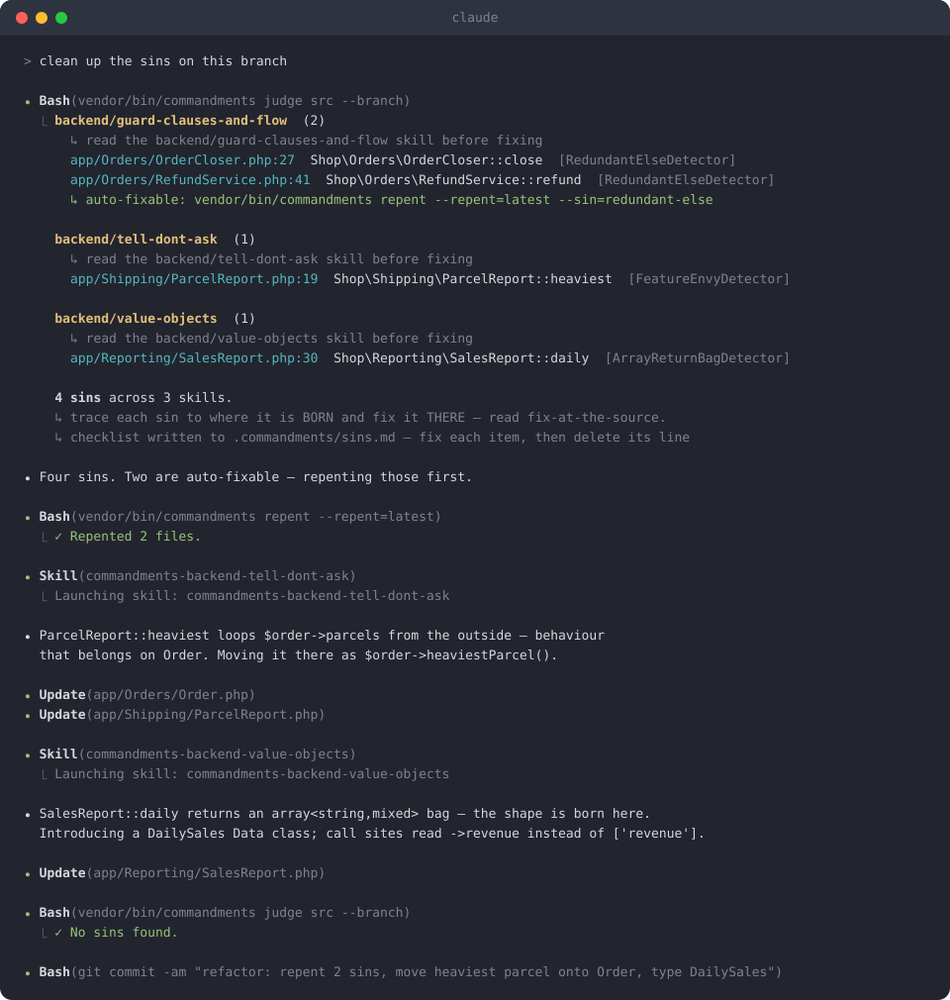

# Code Commandments

> A static code checker for PHP & Vue, built to drive AI coding agents.

**code-commandments** judges a PHP and Vue codebase against a set of architectural
disciplines. Every violation (a "sin") is reported as a `file:line`, grouped under
the **skill** that teaches the fix.

It's built for AI coding agents: point your agent at a codebase and it reads the
skill each sin names, fixes at the source, and re-runs until clean. You can drive
it by hand too.

A linter tells you a line is too long. code-commandments tells you *this array
should be a value object, and here's the discipline that explains why*.

## Contents

- [How it works](#how-it-works)
- [Install](#install)
- [Usage](#usage)
- [Configuration](#configuration)
- [Freezing a file](#freezing-a-file)
- [Agents](#agents)
- [Hooks](#hooks)
- [How detectors are tested](#how-detectors-are-tested)
- [Skills](#skills)
- [Sins & detectors](#sins--detectors)
- [Auto-fixing](#auto-fixing)
- [Scaffolding](#scaffolding)
- [Developing detectors](#developing-detectors)
- [License](#license)

## How it works

The loop is simple:

1. **Judge**: `commandments judge` prints every sin as a `file:line`, grouped by skill.
2. **Learn**: each sin names a **skill**; you (or your agent) read it.
3. **Fix**: fix at the source, or let `commandments repent` [auto-fix](#auto-fixing).
4. **Repeat**: re-run until clean (exit code `0`).

One pass of that loop, with an agent driving:

<p align="center">
  
</p>

Under the hood there are two layers:

- **Skills**: the teaching layer. One doc per discipline, the source of truth for
  what "good" looks like.
- **Sin detectors**: small finders that read the syntax tree. Each finds one kind
  of sin and names the skill that fixes it. Detectors *find*, skills *teach*,
  scribes *[auto-fix](#auto-fixing)*.

**You don't need the packages a rule is about.** Detectors match on real *types*,
so a rule for a package your project doesn't use never fires. Nothing to install
or configure to keep it quiet.

## Install

```bash
composer require --dev jessegall/code-commandments
vendor/bin/commandments install
```

## Usage

```bash
# scan. With no path, judge reads the source roots from .commandments/config.json
# (auto-detected from composer.json on the first run)
vendor/bin/commandments judge
vendor/bin/commandments judge src                  # or point it at a path

# scope to one skill (group) or one sin
vendor/bin/commandments judge src --skill=exceptions
vendor/bin/commandments judge src --sin=swallow-catch

# scope to what you changed
vendor/bin/commandments judge src --branch         # branch vs main (--branch=BASE to override)
vendor/bin/commandments judge src --changes        # uncommitted working-tree changes

# detectors run across 2 workers by default (capped at CPU cores); --parallel=1 disables
vendor/bin/commandments judge src --parallel=4

# skip paths (comma-separated fragments); list everything
vendor/bin/commandments judge src --exclude=Generated,Legacy
vendor/bin/commandments judge --list

# read the dependency stack you already have, and propose the layer declaration for it
vendor/bin/commandments layers                # print it
vendor/bin/commandments layers --write        # add it to .commandments/config.json
vendor/bin/commandments layers --floor        # only the namespaces nothing of yours sits below

# and as the codebase grows, edit the declared stack in place
vendor/bin/commandments layers add 'App\Parts' --may-use='App\Ui\Tokens'
vendor/bin/commandments layers allow 'App\Ui\Pages' 'App\Parts'   # one arrow
vendor/bin/commandments layers --write --refresh                   # regenerate the block
```

Exit code is non-zero when sins are found.

### Every command

<!-- BEGIN: commands-table (auto-generated, run `composer readme`) -->
| Command | Purpose |
|---|---|
| `commandments judge [path]` | Scan a codebase and report its sins, grouped by the skill that fixes each. Exit code 1 when sins are found, 3 when a rule could not run. |
| `commandments make <Name>` | Scaffold a commandment of your own — a rule naming its sin, and the skill that teaches the fix, in `.commandments/custom/`, turned on in your config, with the rest of the process printed for you. |
| `commandments hints [path]` | Auto-fix the Spatie Data magic surface — rename non-`from…` object factories to `from<Type>`, rewrite their call sites to `::from(...)`, and regenerate the `@method from(...)`/`collect(...)` docblock hints. |
| `commandments repent [path]` | Auto-fix sins — run every Scribe: the maintenance rewriters (Spatie Data hints) and each Repentable detector's own fix, backend and frontend. |
| `commandments scaffold` | Generate the reusable helper a sin's fix uses — written into your source root with its namespace injected. Idempotent: an existing file is skipped. |
| `commandments report --reason="…" --ref=PATH:LINE` | File a GitHub issue about code-commandments itself (via `gh`) — a false positive, a wrong rule, or a bug. |
| `commandments feature-request --title="…" --reason="…"` | File a [feature-request] GitHub issue (via `gh`) proposing a new or changed rule. |
| `commandments freeze <path>` | Mark a file intentionally immutable, or lift the mark. A frozen file is still scanned (so cross-file rules stay correct) but never flagged and never rewritten. |
| `commandments sync` | Refresh this project's code-commandments integration — publish the skills into the library every agent reads, refresh the AGENTS.md briefing and the config surface, and wire each agent's own view of them. |
| `commandments install` | Wire a consumer project up once — the composer sync hook, every agent it supports (skills, AGENTS.md, and under Claude Code the hook suite) and .gitignore — then sync. |
| `commandments judge-reminder` | A "did you judge?" nudge wired to `Stop` and `PreToolUse` hooks; reminds when judged files are touched but unchecked, deduped per changed-file set. |
| `commandments session` | Where this session keeps its state — the folder holding its checklist and hook counters. |
| `commandments task` | The work in front of this session — numbered tasks, one markdown file each, moved between queue, active and history. |
| `commandments hooks` | The wired hook entry point — reads one hook payload from stdin, runs every registered handler, and merges their responses into one. |
| `commandments journal-hook` | The agent journal's entry point — reads one journal hook payload from stdin, runs every registered handler, and answers in the journal's shape. |
| `commandments journal-serve` | Answer the agent journal's hooks from one running process, over the socket the journal names in $JOURNAL_PLUGIN_SOCKET. |
| `commandments roslyn-serve` | Keep the C# bridge running for this project, answering each run of the tool over a socket named for the project. |
| `commandments journal-config` | Write the agent journal plugin's chosen switches into .commandments/config.json. |
| `commandments journal-scan` | Scan the project for the folders to check and the ones to leave out, for the agent journal plugin. |
| `commandments journal-skills` | Render the skills into the agent journal plugin's folder, for the journal to publish. |
| `commandments hook <Name>` | Run ONE hook directly, by name — the form every wired hook is written as. |
| `commandments disable <sin\|skill>` | Toggle a rule in the project's .commandments/config.json, leaving the rest of the file as you wrote it — or in a config.php from an earlier version, through its tree, so your own lines are untouched. |
| `commandments config` | Inspect and manage .commandments/config.json — what is configured, and what is actually running. |
| `commandments layers [path]` | Read the dependency stack this project ALREADY has and propose the layer declaration for it — the rule is inert until one is declared, and nobody writes that from a blank file. |
| `commandments exemptions` | List the exemption tags — what a package registers to quiet a general rule on its own boundary types. |
| `commandments info <sin\|detector>` | Explain one sin — what it flags, why it is a sin, how to fix it, and a worked example. |
| `commandments trigger-eval` | Measure whether skill descriptions pull their own skill in — and stay out of their neighbours'. |
<!-- END: commands-table -->

Run `commandments <command> --help` for a command's forms, options and notes — every help screen is
projected from the command itself, so it is never out of date.

## Configuration

**You don't have to configure anything.** Every detector is enabled out of the box.
Configuration is opt-out: silence a rule, tune a threshold, or add a detector of
your own.

A `.commandments/config.json` is scaffolded on install, with a schema beside it
(`config.schema.json`) so an editor completes every rule, sin and skill by name:

```json
{
    "$schema": "./config.schema.json",
    "paths": ["app", "src"],
    "exclude": ["app/Generated"],
    "disable": {
        "sins": ["backend/NonFinalData"],
        "detectors": ["backend/FacadeCallDetector"],
        "skills": ["backend/ValueObjects"],
        "languages": ["python"]
    },
    "configure": {
        "backend/DataClumpDetector": [{"minClasses": [3]}]
    },
    "detectors": ["NoRawSqlDetector"]
}
```

- `paths`: the source roots judge and repent scan with no path given (auto-detected on first run).
- `exclude`: paths never reported on nor rewritten; still parsed, so findings elsewhere stay right.
- `disable`: rules turned off by their sin, their detector, or their whole skill — and whole
  languages, agents or hooks.
- `configure`: a shipped detector tuned, each step one of its methods with its arguments in order.
- `detectors` / `packages`: your own rules and exemption packages from `.commandments/custom/`
  (see [Developing detectors](#developing-detectors)), turned on.

`commandments disable <sin>` and `enable <sin>` edit the file for you, leaving the rest as you wrote
it. Run `commandments config` for a summary of what's in effect. A project that still has a
`config.php` from an earlier version has it turned into `config.json` on the next `composer update`
(the original is kept as `config.php.bak`).

### Declaring your layers

Most rules know a sin when they see one. Dependency *direction* is the exception:
only your project knows which way its arrows are meant to point, so
`NamespaceDependencyDetector` stays completely inert until you say. Declare the
stack top-down and each layer names what it may reach:

```json
"configure": {
    "backend/NamespaceDependencyDetector": [
        {"layer": ["App\\Ui\\Tokens"]},
        {"layer": ["App\\Ui\\Elements", ["App\\Ui\\Tokens"]]},
        {"layer": ["App\\Ui\\Shared", ["App\\Ui\\Elements", "App\\Ui\\Tokens"]]},
        {"layer": ["App\\Ui\\Pages", ["App\\Ui\\Shared", "App\\Ui\\Elements"]]}
    ]
}
```

Every reference out of a declared layer is then judged — `extends`, `implements`, a
trait `use`, a parameter/return/property type, `new X`, `X::method()`, `instanceof`,
a `catch`, an attribute. They are all the same arrow.

- **Both ends must be declared.** A namespace you never named (the framework,
  vendor, code you haven't got to yet) is always allowed, in both directions — so a
  declaration bites in proportion to how much of your tree it covers.
- **A layer contains its own sub-namespaces**, so `App\Ui\Elements\Button` is inside
  `App\Ui\Elements` and references within a layer are always fine.
- **The most specific declared layer wins**, and layers match on segment boundaries —
  `App\UiKit` is not inside `App\Ui`.

You don't have to write any of that by hand. `commandments layers` reads the stack
already implied by your code and prints the declaration; `--write` adds it to
`config.json`, leaving the rest of the file as you wrote it. What it
proposes is today's shape, so everything already passing keeps passing — it costs
nothing to adopt and refuses the *next* arrow pointing somewhere new.

What it emits is green by construction: every reference already in your tree either
stays inside a layer or is named in that layer's `mayUse`, and no layer is ever
declared inside another. Write it and the next judge is silent — the declaration
starts earning its keep on the arrow you draw tomorrow.

Namespaces caught in a cycle are declared as they stand, each permitting the other,
because this command records the shape you have rather than the one you want. They're
listed separately too, since no order can place them: break them with
`judge --sin=namespace-cycle`, which needs no configuration at all, because a cycle is
wrong under any stack.

## Freezing a file

Some files must not change even though they carry sins — a frozen graph migration
whose body deliberately mirrors its siblings, a snapshot committed for the record,
generated code checked into the tree. Freeze such a file:

```bash
vendor/bin/commandments freeze database/migrations/V5ToV6.php
vendor/bin/commandments unfreeze database/migrations/V5ToV6.php   # lift it
```

`freeze` stamps a `@code-commandments-frozen` comment; you can equally mark a class
by hand with a `#[Frozen]` attribute or an `@frozen` docblock tag.

A frozen file is still **scanned** — the call graph, provenance and type resolution
read it, so findings in *other* files stay correct — but it is never a **target**:
it is never flagged by `judge`, and `repent` never rewrites it. Freezing is a scope,
compounded into every scope the tools resolve, so a cross-file fix whose edits would
touch a frozen file is dropped whole rather than half-applied.

Freeze only what is genuinely immutable. A finding you disagree with belongs in a
`report`; a rule you want off belongs in `disable` — freezing is for files that by
their nature cannot move.

## Agents

The disciplines are documents, not one assistant's format — so they are published
once and every agent reads the same copy.

`install` (and every `composer update`, via `sync`) writes the skills into your
project's `.agents/skills/` library and points each agent at them. Nothing to
configure: an agent enrols itself, and `"disable": {"agents": ["CodexAgent"]}` in `.commandments/config.json`
turns one off like any other rule.

<!-- BEGIN: agents-table (auto-generated, run `composer readme`) -->
| Agent | Skills | Instructions | Enforced by hooks | What it gets |
|---|---|---|---|---|
| **Claude Code** | `.claude/skills` _(links)_ | `CLAUDE.md` | yes | skills, `CLAUDE.md` (imports `AGENTS.md`), and the hooks — the only agent whose disciplines are enforced rather than only written down |
| **Codex** | `.agents/skills` _(read directly)_ | `AGENTS.md` | no | skills and `AGENTS.md`, both read where they already live — no links, no hooks |
<!-- END: agents-table -->

The briefing splits the same way. **`AGENTS.md`** carries the canon — the cardinal
rule, the skills to load, the checklist workflow — addressed to no agent in
particular, and read natively by Codex, Cursor, Copilot and the rest of the
`AGENTS.md` ecosystem. **`CLAUDE.md`** is a thin file that imports it (`@AGENTS.md`)
and adds only what is true in that harness. Both are **injected, never overwritten**:
a block between markers, appended if your file has none, and every other line of
your own left exactly as it was.

Your project writes its own agent the same way it writes its own rules — an
`Agents\Agent` subclass in `.commandments/custom/`, discovered beside the shipped
ones.

### Hooks are Claude Code only

A hook needs a harness that fires events at us — `PostToolUse`, `Stop`,
`UserPromptSubmit` — and hands over a project root to anchor on. Claude Code offers
that protocol; Codex has a rich customisation stack of its own (skills, MCP,
subagents, `config.toml`) but no hook events, so there is nothing to wire.

That difference is worth being plain about, because it is the difference between a
discipline that is **enforced** and one that is merely **written down**. Under Claude
Code the rule you just broke is named on the edit that broke it, `judge` is nudged
before risky commands and on stop. Under any other agent all of that is still available —
the skills, `AGENTS.md`, and `judge` / `repent` as ordinary CLI verbs — but nothing checks
that the agent used them.

One further gap: session state is scoped by `CLAUDE_CODE_SESSION_ID`, so under another agent every run shares the
`default` session folder. Fine for one session at a time; concurrent runs would
share a checklist.

**Migrating from an older release.** It happens on the next `composer update`, with
nothing to configure: the skills move to the library, `.claude/skills/` becomes
links, the inline `CLAUDE.md` briefing becomes the `@AGENTS.md` import, and the
ignore rules are corrected. Expect a one-time diff — files genuinely move, and if
you had force-committed `.claude/skills/` you will see those deletions.

## Hooks

`install` (and every `composer update`, via `sync`) wires a set of **Claude Code
hooks** into `.claude/settings.json`: the per-edit rule check, the "did you
judge?" nudge, the skill-invocation nudge. They self-heal: a hook change reaches
every project on the next `composer update`. They are Claude Code only — see
[Agents](#agents) for what that means under a different assistant.

**Your own hooks are never touched.** Every wired command carries a
`# @code-commandments-managed` stamp, and re-wiring strips only stamped commands.
A hook you wrote by hand is always preserved.

The wired hooks — one dispatcher entry per Claude Code event, each fanning out to these handlers:

<!-- BEGIN: hooks-table (auto-generated, run `composer readme`) -->
| Hook | Events | What it does |
|---|---|---|
| `JudgeReminder` | `Stop, PreToolUse/Bash` | Nudges you to `judge` what you changed — before a risky Bash command, and on stop. |
| `SharedBranchGate` | `PreToolUse/Bash` | Refuses `git pull --rebase` while other worktrees stand on the branch — it rewrites the commits they are built on. |
| `ModelChoiceReminder` | `PreToolUse/Agent` | Asks for an explicit model when an agent is dispatched without one, since an unnamed model inherits the dispatcher's. |
| `SessionReset` | `SessionStart` | On a fresh session (startup/clear) wipes lingering hook counters and prunes stale session folders. |
| `SourceReminder` | `PreToolUse/Edit, PreToolUse/Write, PreToolUse/MultiEdit` | When you edit a test/stub/fixture (which `judge` never scans), nudges you to check the real fix belongs at the SOURCE. |
| `SkillReminder` | `PostToolUse/Edit, PostToolUse/Write, PostToolUse/MultiEdit, PostToolUse/Bash` | After an edit — including one made with the shell — checks the files against the rules that can judge one file and names the skill that teaches the fix. |
<!-- END: hooks-table -->

### Under the agent journal

In a project that runs the [agent journal](https://github.com/jessegall/agent-journal), the journal
already owns the hooks — it sees every tool call and decides what reaches the agent. Install this
package as a journal plugin and the two share one chain instead of wiring two:

```
journal plugin install <path-or-url-to-this-package>
```

The plugin declares `.journal-plugin/plugin.json`. On install it files `commandments judge` as a
journal **check**, so a failing judge files a notification and is told to the agent, and the next
clean pass clears it. Every moment the journal sees is handed to `commandments journal-hook`, which
runs the same handlers as `commandments hooks`: a nudge comes back as a journal line to the agent
alone, and a refusal — the shared-branch gate, for one — stops the tool call with its own reason.

Its settings, in the journal's Plugins page, are a switch for every sin — named, with what it
flags, grouped under the skill that teaches its fix — and a switch per language. They are generated
from the registry by `composer readme`, so they never drift. Flipping one writes
`.commandments/config.json` through `commandments journal-config`, the same `disable` entry you
would write by hand; the rest of the file is kept.

While the plugin is installed, `install` and `sync` wire **no** Claude Code hooks of their own: the
journal calls them. Take the plugin away and the next `composer update` wires them back.

### Turning hooks on and off

The hooks are the tool's own. Every project runs the default set; one that is off by default is turned on by
name under `"hooks"` in `.commandments/config.json`, and any is turned off under `"disable": {"hooks": […]}` —
the schema beside the config lists every one by name.

## How detectors are tested

Every detector is proven against a **self-checking fixture**: a small, deliberately
imperfect example app that is never run, only scanned.

You mark the exact spots where a detector should fire by naming the **sin**
(naming the detector class works too):

- in PHP, a `#[Sinful(...)]` attribute;
- in Vue, a `<!-- @sin ... -->` comment.

```php
// tests/Fixtures/backend/app/Orders/RefundService.php
use JesseGall\CodeCommandments\Sins\Backend\SwallowCatch;
use JesseGall\CodeCommandments\Testing\Sinful;

final class RefundService
{
    // the marker IS the assertion: the SwallowCatch detector must flag this method.
    // if it doesn't fire here, the fixture test fails.
    #[Sinful(SwallowCatch::class)]
    public function refund(Order $order): void
    {
        try {
            $this->gateway->refund($order->id);
        } catch (\Throwable) {
            // swallowed into silence: the sin
        }
    }
}
```

```vue
<!-- tests/Fixtures/frontend/components/UserBadge.vue -->
<template>
  <!-- the marker IS the assertion: the next element must be flagged -->
  <!-- @sin ControlFlowOnElement -->
  <div v-if="user">{{ user.name }}</div>

  <!-- the good-code example; if this gets flagged, the test fails -->
  <!-- @righteous ControlFlowOnElement -->
  <template v-if="user">
    <div>{{ user.name }}</div>
  </template>
</template>
```

Those markers are the test spec. The harness runs every detector over the whole
fixture and fails if either:

- a marked spot is **missed** (the detector has a hole), or
- an **unmarked** spot is flagged (a false positive).

Each detector must also fire on **≥3 genuinely different** examples.

Any unmarked code is already "righteous", so the whole rest of the fixture guards
against false positives; you don't mark good code. One `#[Righteous]` /
`<!-- @righteous -->` per detector is required: a deliberate look-alike the
detector must NOT flag.

A third marker, `#[Fixed(...)]`, is the one the docs publish as "Good": the
sinful code **repaired the way the rule says**. It is a different claim from
`#[Righteous]` — a righteous twin is usually a documented *exemption*, code that
legitimately dodges the rule, whereas a fixed twin is what the bad code should
become. The generated `## Bad → good` prefers `#[Fixed]` and falls back to
`#[Righteous]` only where none exists.

### Testing your own detectors

A rule of your own is proven the same way the shipped ones are calibrated: a probe file holding one example of
every form it must catch and the near-misses it must not, judged with `--sin=<your-sin>`, then a scoped run
over your real code read by eye. The `commandments-writing-detectors` skill walks through it.

## Skills

The teaching layer: one discipline each, the doc an agent reads to fix a sin.
Every `SKILL.md` is generated from its class (`composer sins`).

<!-- BEGIN: skills (auto-generated, run `composer readme`) -->
_64 skills. Full table in [README.skills.md](README.skills.md)._
<!-- END: skills -->

## Sins & detectors

Every sin (the `--sin=` key) and what it flags. Each sin has one detector that
finds it, named `<Sin>Detector` (e.g. `SwallowCatch` → `SwallowCatchDetector`).

<!-- BEGIN: detectors (auto-generated, run `composer readme`) -->
_255 sins across 63 skills. Full tables in [README.sins.md](README.sins.md)._
<!-- END: detectors -->

## Auto-fixing

Most fixes are domain-specific: the skill teaches, your agent applies the fix at
the source. But some sins have a single mechanical fix, and for those the tool
ships a **scribe**.

A scribe is a small deterministic rewriter. It edits the parsed syntax tree, not
the text, so the change is exact and formatting-safe. There are two kinds,
*whole-tree maintenance passes* and *per-sin fixes*, both listed in
[README.scribes.md](README.scribes.md). The `repent` command runs them all until
nothing changes.

For example, a backend `LoopInvertedGuard` (a whole loop body wrapped in an `if`)
is rewritten to a `continue` guard:

```php
// before                                    // after (repent)
foreach ($rows as $row) {                     foreach ($rows as $row) {
    if ($row->valid()) {                          if (! $row->valid()) {
        $this->import($row);                          continue;
    }                                             }
}
                                                  $this->import($row);
                                              }
```

…and a frontend `SwitchCase` (a `v-if`/`v-else-if` chain re-testing one value) is
hoisted into a `<SwitchCase>`, one slot per case:

```vue
<!-- before -->
<span v-if="status === 'paid'" class="badge badge-green">Paid</span>
<span v-else-if="status === 'pending'" class="badge badge-amber">Pending</span>
<span v-else class="badge">Unknown</span>

<!-- after (repent) -->
<SwitchCase :value="status">
  <template #paid>
    <span class="badge badge-green">Paid</span>
  </template>
  <template #pending>
    <span class="badge badge-amber">Pending</span>
  </template>
  <template #default>
    <span class="badge">Unknown</span>
  </template>
</SwitchCase>
```

`<SwitchCase>` is a utility component the package provides; `repent` scaffolds it
automatically when a fix introduces it, so the rewritten tree compiles (see
[Scaffolding](#scaffolding)).

### Running `repent`

```bash
# preview every auto-fix as a unified diff; nothing is written
vendor/bin/commandments repent src --dry-run

# apply them
vendor/bin/commandments repent src
vendor/bin/commandments repent resources/js
```

<!-- BEGIN: scribes (auto-generated, run `composer readme`) -->
_`repent` auto-fixes 32 sins, plus 1 whole-tree maintenance passes. Full tables in [README.scribes.md](README.scribes.md)._
<!-- END: scribes -->

`repent` keeps applying scribes until nothing changes, so one run fully converges.

It takes the same scope flags as `judge`:

```bash
vendor/bin/commandments repent src --changes            # only working-tree changes
vendor/bin/commandments repent src --branch             # only branch changes vs main
vendor/bin/commandments repent src --branch=develop     # ...vs a different base
```

The whole tree is still parsed (cross-file rewrites stay correct); only the files
that get written are scoped.

### Prop types when extracting components

When an extract scribe lifts a chunk into its own component, it types every prop
it generates. Types are resolved by sound AST inference first: a `ref`/`computed`
literal, a homogeneous literal array (`[50, 100, 200]` → `number[]`), a
destructured composable's return field, a loop variable's element type, a prop
traced up the render tree. Nothing is guessed; what only a real type checker could
resolve stays `unknown`.

If the project already ships `vue-tsc`, a last rung asks it to resolve what the
AST couldn't. It is never a dependency of the package. The checker runs
`--incremental` with `--skipLibCheck`, batched to one run per component.

## Scaffolding

Some fixes need a reusable construct to point at: a no-op invokable to default an
optional callback to, a `<SwitchCase>` component to hoist a `v-if` chain into. The
package ships these as stubs and generates them into your project:

```bash
# generate every helper the applicable sins need (idempotent; existing files are skipped)
vendor/bin/commandments scaffold

# ...or just one sin's construct
vendor/bin/commandments scaffold --sin=switch-case
vendor/bin/commandments scaffold --sin=nullable-callback --dry-run
```

A scaffold lands in the right root for its kind (a PHP helper under your PSR-4
source root with your namespace injected, a Vue component under `resources/js`)
and is never overwritten, so it's safe to re-run and safe to edit.

`repent` runs `scaffold` for you: when a fix introduces a construct, it's minted
in the same run. Run `scaffold` yourself only when you want the construct before
repenting.

## Developing detectors

A rule of your own is data the binary runs: a `.json` file in `.commandments/custom/` naming the engine it
judges, the sin it finds, and a query composed from the same selectors and checks every shipped detector
composes — a **selector** opens it, **`where`** steps keep a node and **`reject`** steps drop one, one check
each. Beside it, a skill of your own (a folder holding a `SKILL.md`) teaches the fix.

```json
{
    "engine": "backend",
    "sin": {
        "name": "raw-sql",
        "description": "SQL written inline at a call site.",
        "rule": "Queries go through the repository that owns the table.",
        "skill": "no-raw-sql"
    },
    "find": {
        "select": "call",
        "where": [
            {"resolves": "Illuminate\\Support\\Facades\\DB", "of": "child:class"},
            {"nameIn": ["select", "statement", "unprepared"]}
        ],
        "reject": [
            {"file": "*Repository.php"}
        ]
    }
}
```

`commandments make <Name>` scaffolds both and turns the rule on in your config; the published
**`commandments-writing-detectors`** skill teaches every selector and check, and the probe-then-calibrate
discipline that proves a rule fires on what you meant — classify by what the code **is**, never by a name
or a hardcoded list.

A rule you own is marked as yours everywhere it is named: `judge` prints its findings as
`[YourDetector (custom)]` (in the console and in the checklist, with a note that the fix belongs in
`.commandments/custom/`), `judge --list` tags it, and `commandments report --detector=YourDetector` refuses
to file — the package cannot answer for a rule it does not ship.

## License

MIT.
